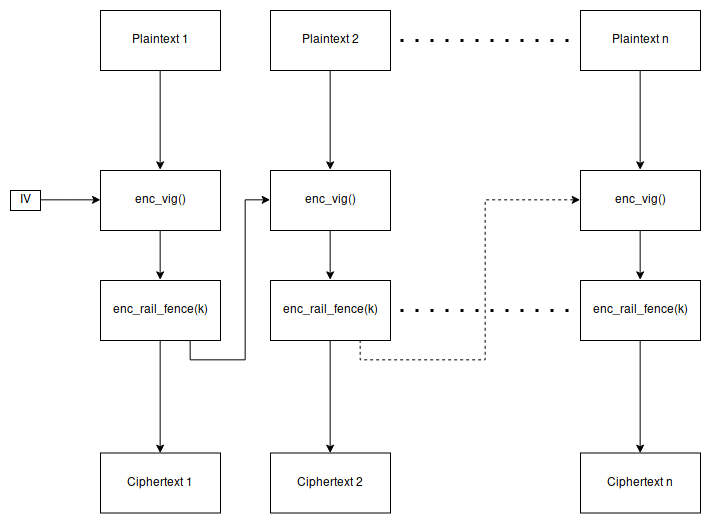

# MicroClub CTF Final 2019 - Back to the old ways


## Challenge description

There is a group of hackers that we've been trying to take down for a while, we had a spy among them but his cover was compromised, but he managed to leak a piece of code running on their main socket, try to get admin access.

nc 52.59.5.86 1111

**Objective:** Get admin access

## Solution

I first tried to use the public service

```bash
[youben@ym ~]$ ncat 52.59.5.86 1111
[1] register
[2] login
1
[+] name:
youben
[+] password:
password
[+] this is your hex-encoded cookie: 6625205b724457776f2e753f7c3463542a3f584254547d6a77493c0b09714c3a2761476358606a6e45653a5d
[1] register
[2] login
2
[+] cookie(in hex):
6625205b724457776f2e753f7c3463542a3f584254547d6a77493c0b09714c3a2761476358606a6e45653a5d
[-] access is for admins only
[1] register
[2] login
```

It seems like our information are stored in that cookie and are checked when we try to login to see if we have admin rights. So the goal is to construct a valid admin cookie. Let's check the provided code

```python
#all what u need is here

from string import printable as alpha

def encrypt(msg,key,iv):
    if len(msg) % 11 != 0:
        msg += alpha[len(msg) % 11] * (11 - len(msg) % 11)
    l = [msg[i:i+11] for i in range(0,len(msg),11)]
    ct = []
    for i in l:
        tmp = viginereEncrypt(i,iv)
        tmp = railFenceEncrypt(tmp,key)
        ct.append(tmp)
        iv = tmp
    return ''.join(ct)

def decrypt(msg,key,iv):
    l = [msg[i:i+11] for i in range(0,len(msg),11)]
    pt = []
    for i in l:
        tmp = railFenceDecrypt(i,key)
        tmp = viginereDecrypt(tmp,iv)
        pt.append(tmp)
        iv = i
    return ''.join(pt)
```

The encryption can be illustrated in the figure below



It's using vigenere and railfence in [CBC](https://en.wikipedia.org/wiki/Block_cipher_mode_of_operation) mode, the keyspace for railfence here is computable (only 10 possible keys), so if we know the last plaintext then we can just try decrypting the last ciphertext with the possible keys until we found the correct one that decrypts to our know plaintext, thanks to the padding for that, if len(plaintext) % 11 == 1 then it will be padded with 10 '1', however, we must first understand how it's constructing the plaintext cookie.

Trying different inputs, I discovered that a name and password of length 6 + 11k gives us a padding of 10 '1', so we can now decrypt the last block with the 10 possible keys and check until we get those 10 '1' and decrypt the whole cookie except the first block cause we don't have the IV.

Decrypting the cookie gave me '](yv$zHX?B)&password=&admin=false&1111111111', seems like we only need to replace that 'false' with a 'true' and reconstruct a valid cookie. You can check the complete code for doing that below

```python
from string import printable as alpha
from binascii import unhexlify, hexlify


def encryptRailFence(text, key):
    rail = [['\n' for i in range(len(text))]
                  for j in range(key)]
    dir_down = False
    row, col = 0, 0

    for i in range(len(text)):
        if (row == 0) or (row == key - 1):
            dir_down = not dir_down

        rail[row][col] = text[i]
        col += 1
        if dir_down:
            row += 1
        else:
            row -= 1
    result = []
    for i in range(key):
        for j in range(len(text)):
            if rail[i][j] != '\n':
                result.append(rail[i][j])
    return("" . join(result))


def decryptRailFence(cipher, key):
    rail = [['\n' for i in range(len(cipher))]
                  for j in range(key)]
    dir_down = None
    row, col = 0, 0

    for i in range(len(cipher)):
        if row == 0:
            dir_down = True
        if row == key - 1:
            dir_down = False

        rail[row][col] = '*'
        col += 1

        if dir_down:
            row += 1
        else:
            row -= 1
    index = 0
    for i in range(key):
        for j in range(len(cipher)):
            if ((rail[i][j] == '*') and
               (index < len(cipher))):
                rail[i][j] = cipher[index]
                index += 1
    result = []
    row, col = 0, 0
    for i in range(len(cipher)):
        if row == 0:
            dir_down = True
        if row == key-1:
            dir_down = False
        if (rail[row][col] != '*'):
            result.append(rail[row][col])
            col += 1
        if dir_down:
            row += 1
        else:
            row -= 1
    return("".join(result))


def decryptVig(ciphertext, key):
    key_length = len(key)
    key_as_int = [alpha.find(k) for k in key]
    ciphertext_int = [alpha.find(c) for c in ciphertext]
    plaintext = ''
    for i in range(len(ciphertext_int)):
        p = (ciphertext_int[i] - key_as_int[i % key_length]) % len(alpha)
        plaintext += alpha[p]
    return plaintext


def encryptVig(plaintext, key):
    key_length = len(key)
    key_as_int = [alpha.find(k) for k in key]
    plaintext_int = [alpha.find(p) for p in plaintext]
    ciphertext = ''
    for i in range(len(plaintext_int)):
        c = (plaintext_int[i] + key_as_int[i % key_length]) % len(alpha)
        ciphertext += alpha[c]
    return ciphertext


def decrypt(msg,key,iv):
    l = [msg[i:i+11] for i in range(0,len(msg),11)]
    pt = []
    for i in l:
        tmp = decryptRailFence(i,key)
        tmp = decryptVig(tmp,iv)
        pt.append(tmp)
        iv = i
    return ''.join(pt)


if __name__ == '__main__':
    # name: 'aaaaaa'
    # password: ''
    expected_chars = '1' * 10
    cookie = "2a6f0c58475c0a7c6b3533434e395e29686b6978295c4d2176357e0d7a73530c0b66227736200b4174540c30"
    cipher = unhexlify(cookie).decode()
    ciphers = [cipher[i:i+11] for i in range(0, len(cipher), 11)]
    last_cipher = ciphers[-1]
    rf_key = -1
    for i in range(2, 11):
        p = decryptRailFence(last_cipher, i)
        p = decryptVig(p, ciphers[-2])
        if expected_chars in p:
            print("Found RF key: %d" % i)
            rf_key = i
    print(decrypt(cipher, rf_key, "0"))
    admin_val = "admin=true&"
    # construct the admin cookie
    cons = encryptVig(admin_val, ciphers[-3])
    cons = encryptRailFence(cons, rf_key)
    ciphers[-2] = cons
    # print admin cookie
    print(hexlify(''.join(ciphers[:-1]).encode()))
```

Finally, I only got a new cookie by registering, constructed a valid admin cookie from it, used it to login and get the flag :)

```bash
[youben@ym ~]$ ncat 52.59.5.86 1111
[1] register
[2] login
1
[+] name:
aaaaaa
[+] password:

[+] this is your hex-encoded cookie: 2a6f0c58475c0a7c6b3533434e395e29686b6978295c4d2176357e0d7a73530c0b66227736200b4174540c30
[1] register
[2] login
2
[+] cookie(in hex):
2a6f0c58475c0a7c6b3533434e395e29686b6978295c4d2176357e0d4e4a22515b
MCTF{mochi_mochi,CBC desu?!}
[1] register
[2] login
```

Thanks to [th3jackers](https://www.facebook.com/th3jackers) for the nice challenge.
